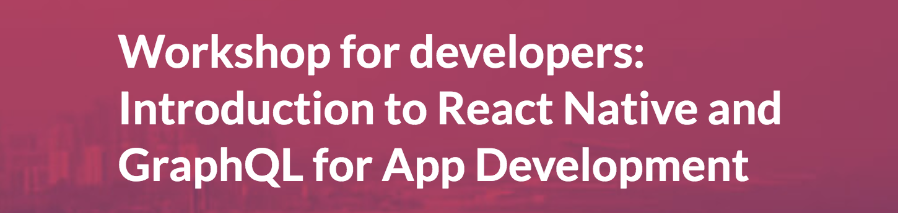

# Movies & Directors - GraphQL Server - ADDC Workshop 2018

This is the companion repository for the Workshop "Introduction to React Native and GraphQL for App Development" at ADDC 2018 in Barcelona.

## The Workshop 😎
The objective of the workshop is to provide base understanding of:

 - ✅ _React Native_ framework and
 - ✅ _React_ designs principles by by building a 
 - ✅ _Native App_ for iOS and Android 
platform.   

Additionally, 
 - ✅ _GraphQL_ query language 
 
 will be presented and used during the workshop as a strategic companion for frontend development and perfect match for React design.    
 
By the end of the workshop you will be capable of understanding the technologies involved and proactively progress in your learning journey.

There are 2 repositories for this workshop.  
- 👉 This repository contains the GraphQL server codebase.  
- 👉 This one [here](https://github.com/nzaghini/react-native-graphql-addc-2018) contains all the React Native codebase.

## Prepare for the Workshop 🤓

For a smoother and faster start of the workshop, please make sure you have your env setup and a running React Native App as per instructions on this [repository](https://github.com/nzaghini/react-native-graphql-addc-2018).

## Environment setup 💻
It is not strictly required that you setup your machine to run a GraphQL server as an hosted service will be used during the course.

If you wish to run the GraphQL instance on your machine simply check out this project and run `npm install`.

### Run the GraphQL Server 📊

Once the dependencies are properly installed just run `npm start` in the root folder.   
This will run a node server with monitor capabilities so that any changes to the source code are immediately available without the need to restart the server.   

Most likely your local GraphQL server will be available at http://localhost:3000/graphql while the GraphiQL interface at http://localhost:3000/graphiql.

## Repository Evolution 🤤
This repository won't stale at the Workshop date. It will continue growing with extra features over time as a best practice example project of GraphQL. Future development will include:
- More tests 
- GraphQL mutations
- GraphQL subscriptions
- Schema sticking 
- Fragments
- ... 
